### 3-40

```sql
SELECT COUNT(*) FROM 图书
```


### 3-41

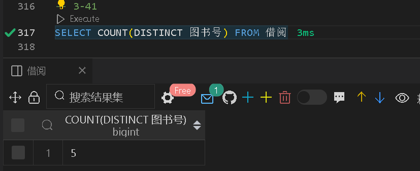

### 3-42

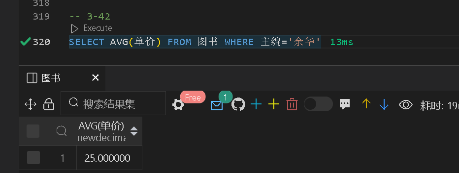

### 3-43

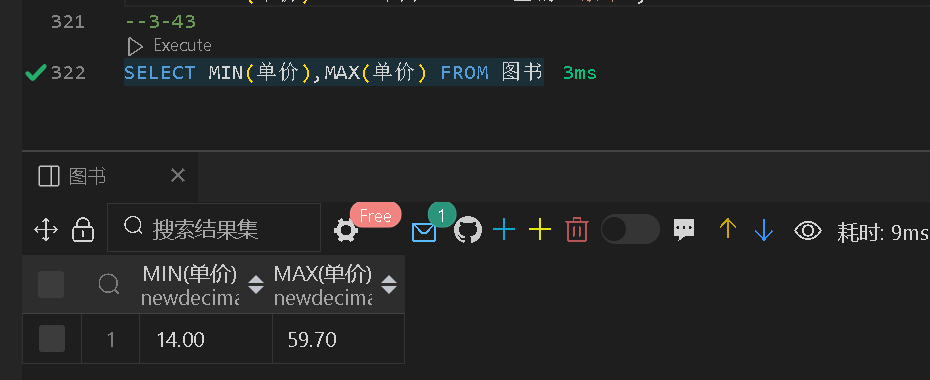

### 3-44

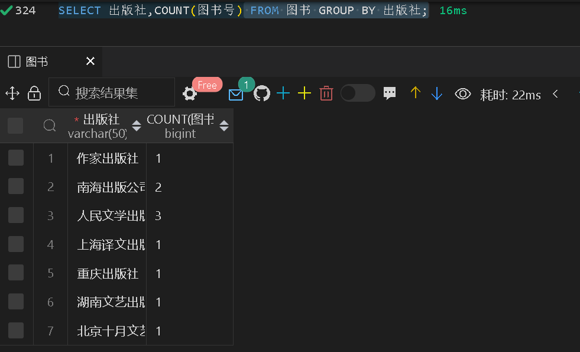

### 3-45

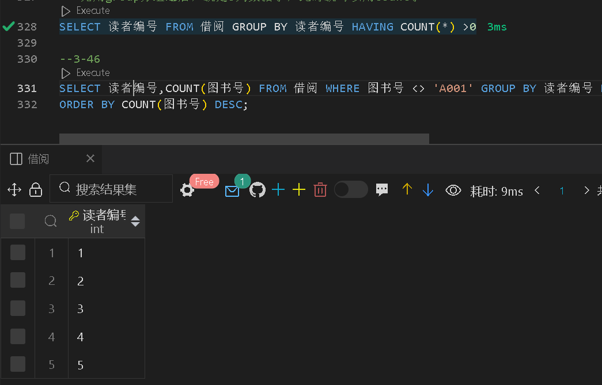

### 3-46

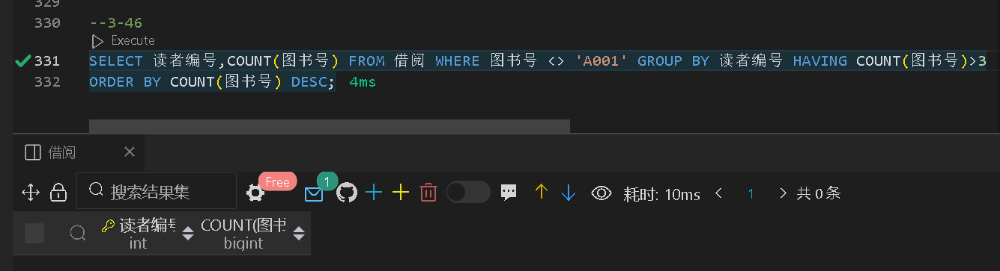

### 3-47

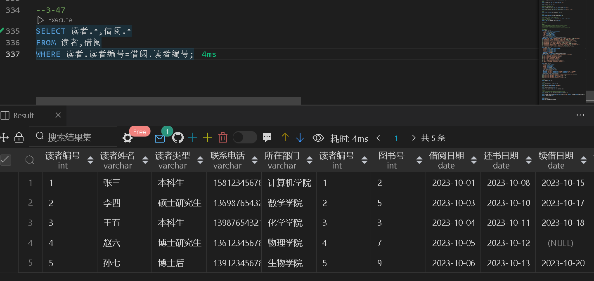

### 3-48

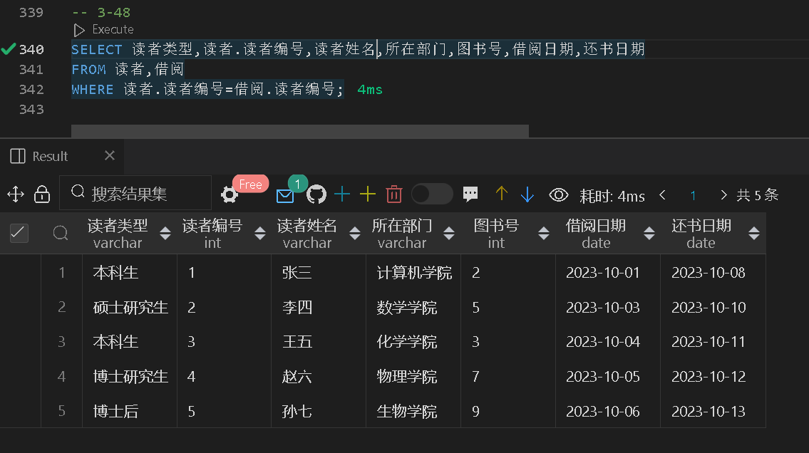

### 3-49

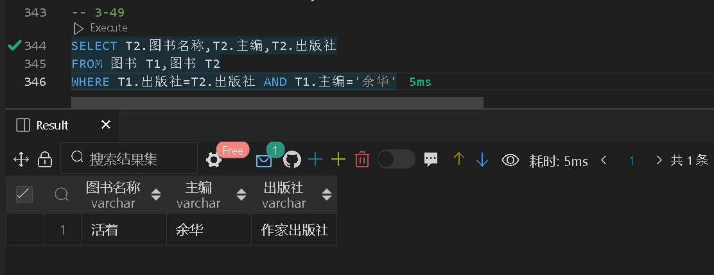

### 3-50

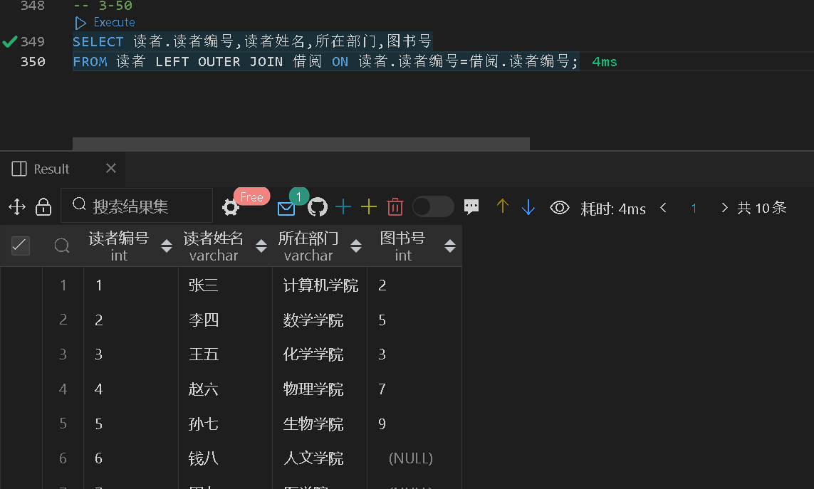

### 3-51

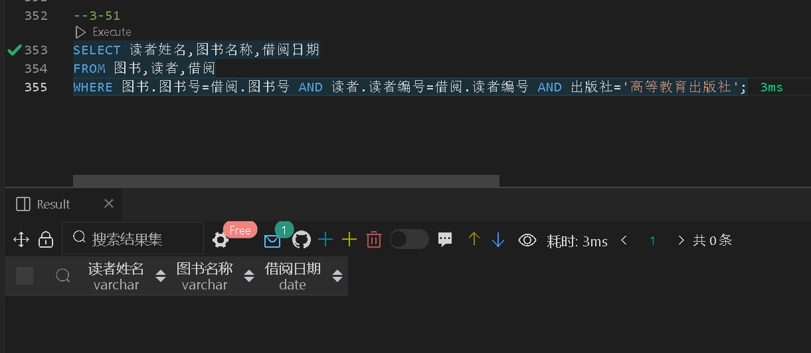

### 3-52

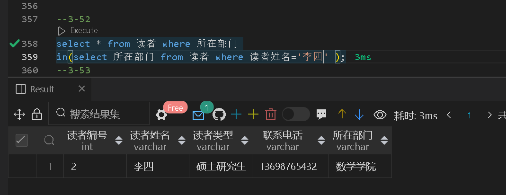

### 3-53

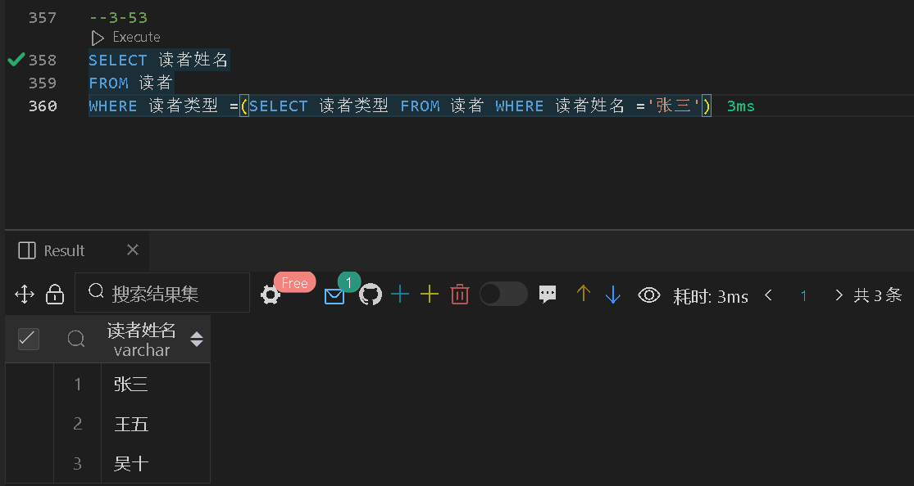

### 3-54

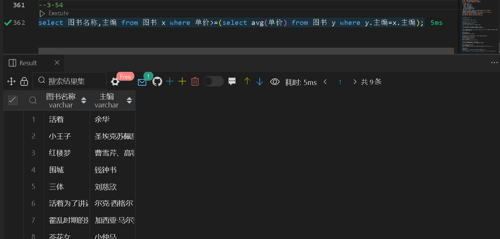

### 3-55

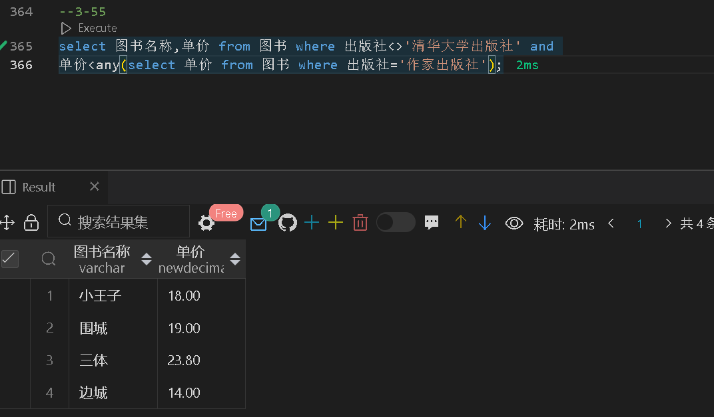

### 3-56

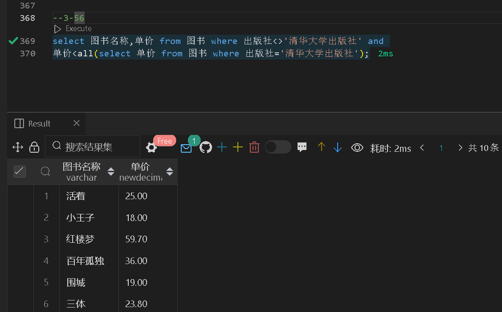

### 3-57

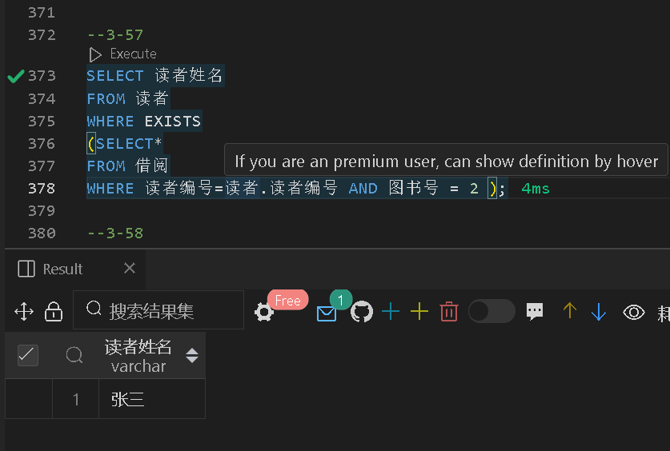

### 3-58

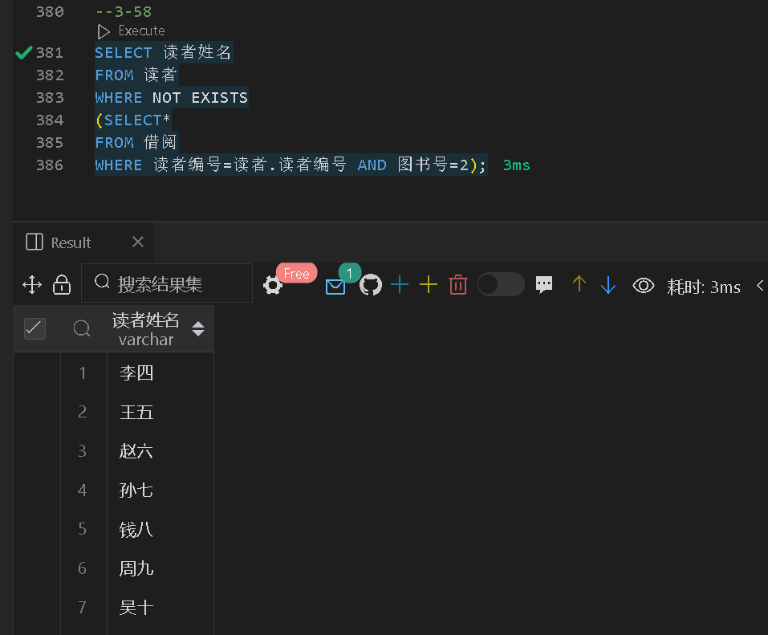

### 3-59

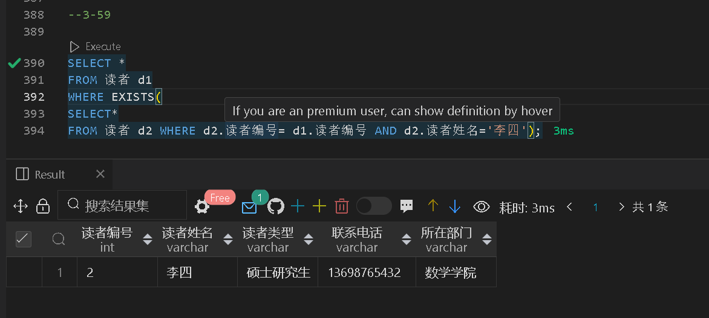